# Normalized D1 ERD

> Conceptual scaffold only. The canonical tables, fields, and invariants are specified in
> [`local-first-rewrite-spec.md`](local-first-rewrite-spec.md).

The D1 model is normalized for authorization, synchronization, and reporting. Recipe and meal sidecars belong
to their parent aggregate; Dexie collapses each family into one complete aggregate record.

```mermaid
erDiagram
    users ||--o{ recipes : owns
    users ||--o{ household_memberships : joins
    households ||--o{ household_memberships : has
    users ||--o{ household_invites : creates
    households ||--o{ household_invites : issues
    households ||--o{ household_appliances : configures

    recipes ||--o{ recipe_ingredients : contains
    recipes ||--o{ recipe_instructions : contains
    recipe_instructions ||--o{ recipe_instruction_events : annotates
    recipes ||--o{ recipe_appliance_requirements : requires
    recipes ||--o{ recipe_classifications : classifies
    recipes ||--o{ recipe_media : presents
    recipes ||--o{ recipe_nutrition_facts : measures

    households ||--o{ meals : plans
    recipes o|--o{ meals : provenance
    meals ||--o{ meal_ingredients : contains
    meals ||--o{ meal_instructions : contains
    meal_instructions ||--o{ meal_instruction_events : annotates
    meals ||--o{ meal_appliance_requirements : requires
    meals ||--o{ meal_classifications : classifies
    meals ||--o{ meal_media : presents
    meals ||--o{ meal_nutrition_facts : measures
    meals ||--o{ meal_check_ins : receives
    users ||--o{ meal_check_ins : reports

    units o|--o{ foods : default_unit
    foods ||--o{ food_aliases : named_by
    units ||--o{ unit_aliases : named_by
    users ||--o{ food_preferences : chooses
    foods ||--o{ food_preferences : concerns
    foods ||--o{ food_display_preferences : displayed_as
    units ||--o{ unit_display_preferences : displayed_as

    households ||--o| billing_subscriptions : enables_sync
    users ||--o{ billing_subscriptions : subscribes
    users ||--o{ mcp_keys : owns
    mcp_keys ||--o{ mcp_key_households : grants
    households ||--o{ mcp_key_households : scopes

    users ||--o{ sync_devices : authenticates
    users ||--o{ sync_changes : acts
    users o|--o{ sync_changes : user_audience
    households o|--o{ sync_changes : household_audience
```

Polymorphic taxonomy scopes and sync audiences are enforced by checked domain commands plus scoped indexes;
their nullable scope IDs are intentionally not represented as ambiguous SQL foreign keys. A meal has at most
one nullable source recipe. Deleting that recipe nulls provenance and preserves meal history.
