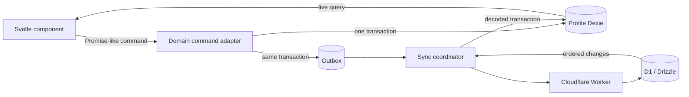

# Rewrite foundation

## Provenance and scope

The rewrite was planned from prototype branch `main` at commit
`74a12ec38f6c297d1a6adbf596234c45212bac11`. No prototype route, store, or data-access implementation is
present. The only behavior eligible for a later clean port is the schedule scroll/snap SDK after framework-
neutral characterization tests exist.

This is one SvelteKit application package. A monorepo would add release and dependency boundaries that the
domain does not need.

## Runtime authority

Dexie is the only domain data source observed by authenticated UI. HTTP never hydrates components or client
stores directly. A successful remote response becomes visible only after its canonical change is applied to
Dexie and a live query emits the new value.

## Module boundaries

| Module           | May depend on                                     | Must not depend on                                               |
| ---------------- | ------------------------------------------------- | ---------------------------------------------------------------- |
| `src/lib/domain` | Effect Schema and pure TypeScript                 | SvelteKit, Dexie, Drizzle, WorkOS, Stripe, HTTP, browser globals |
| `src/lib/client` | Domain contracts, Dexie, browser APIs             | D1, Drizzle, server secrets, direct component imports            |
| `src/lib/server` | Domain contracts, Drizzle/D1, WorkOS, Stripe, MCP | Dexie, DOM APIs, Svelte components                               |
| `src/routes`     | Thin client/server adapters                       | Business rules, unchecked persistence values                     |

Authenticated routes live in the `(app)` route group and set `ssr = false`. Public and legal routes may live
in separate groups and opt into static prerendering. Worker endpoints remain server-rendered adapters.

## Contract and persistence rules

Effect Schema validates every network and persistence boundary. Schema decoding happens before domain code
and never during Svelte rendering. Drizzle rows and versioned Dexie aggregates receive explicit mappers.
Commands atomically update the local aggregate and append an outbox mutation; components never perform
network work as part of a domain edit.

See `local-first-rewrite-spec.md` for the canonical architecture and field-complete schema, with
`effect-schema-conventions.md` supplying contract style.

## Resource isolation

Cloudflare resources identify environments, not application releases. Local development uses Worker and D1
name `maal-local`. Staging uses Worker and D1 name `maal-staging`. Production uses Worker `maal` and D1
`maal-prod`. The tracked Wrangler configuration retains the existing staging and production D1 IDs.

Each D1 database evolves through the committed forward-only migration chain. Releases, including a future v2,
never create a replacement D1 database for an application or schema version. Inspect the target environment,
record a recovery bookmark, and migrate that database in place.

The one shared device database is `maal-v1:<environment>`. Profiles, domain records, outbox entries, and sync
scopes retain explicit user/household ownership. Service-worker cache names use a distinct `maal-v1` namespace.
Those browser-local version namespaces are independent of Cloudflare resource names.

## Release baseline

The pinned pnpm version in `package.json` and `pnpm-lock.yaml` define dependency resolution. CI installs from
that lockfile, lints, type-checks, runs unit and browser tests, builds the Cloudflare Worker, and enforces the
initial JavaScript budget. Remote deployment updates the long-lived environment resources in place.
