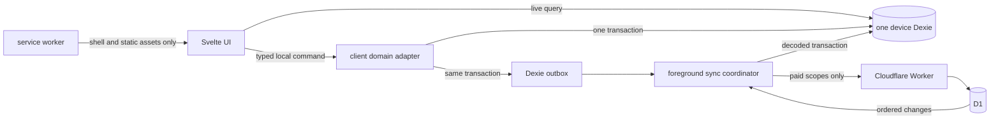

# Maal local-first rewrite specification

Status: implementation-driving v1 specification

Prototype authority: `main` at `74a12ec38f6c297d1a6adbf596234c45212bac11`

Prototype UI authority: the same commit's product routes, components, design tokens, and interaction modules

Decision record: [`../wayfinder/local-first-rewrite/map.md`](../wayfinder/local-first-rewrite/map.md)

## 1. Product and system boundary

Maal is a complete local meal-planning application. Recipes, meals, focused check-ins, taxonomy, preferences,
multiple real local profiles, and file import/export work without a subscription. One household-level **Maal**
plan adds every server-backed feature: D1 synchronization, cross-device household collaboration, MCP, and
future remote compute or integrations.

V1 includes profiles, recipes, meals, households, custom invite codes, import/export, focused check-ins, the
implemented taxonomy and preferences, billing, sync, MCP, and PWA behavior. It excludes groceries, pantry,
anonymous profiles, passkeys, owned-image ingestion/R2, external grocery integrations, bring-your-own storage,
alternate identity providers, prototype-data migration, and marketing work.

Portable file import/export is free and local. Importing a recipe from a remote URL is an existing core Maal
feature, not a future grocery integration; because fetching and parsing arbitrary sites requires Maal's Worker,
it is rate-limited and included in the one paid Maal plan.

The locked stack is SvelteKit, Effect Schema, Dexie/IndexedDB, Cloudflare Workers, D1/Drizzle, WorkOS, Stripe,
the Agents SDK stateless MCP handler, Vitest, and Playwright.

### 1.1 Preserve the finished product UI

This is a data-architecture rewrite, not a product redesign. Every in-scope product surface already implemented
at the prototype authority commit is carried forward with the same information architecture, visual system,
responsive layouts, copy, accessibility behavior, and interactions. Implementers replace server-backed stores
and route data at their seams with Dexie commands and live queries; they do not recreate or reinterpret the UI.

In particular, the dashboard slice reuses `src/lib/interaction/scroll-sdk.ts`, the complete
`src/lib/components/dashboard/*schedule*` family, its drag/drop and keyboard interactions, the calendar and
range-calendar primitives, and their existing tests. Calendar modes, continuous scrolling, retargetable
animation, prepend-position preservation, fast-scroll overlays, meal-pool behavior, and responsive views are
release behavior. Equivalent-looking replacements do not satisfy this requirement.

## 2. Runtime architecture

- Dexie is the only domain source observed by authenticated UI. HTTP results are decoded and committed to
  Dexie before they become visible.
- A client command validates with Effect Schema and atomically writes the aggregate, conflict clock, and
  outbox mutation. Network availability never decides whether a local command succeeds.
- The foreground, profile-scoped coordinator is the v1 correctness path. The service worker is not a fake
  local server and is not between the UI and Dexie.
- The service worker owns application-shell caching, offline navigation, and coordinated updates. Optional
  background sync may later call the same coordinator protocol, but correctness cannot depend on it.
- The Worker authenticates every remote operation, authorizes current WorkOS membership and Maal capability,
  then touches D1. No browser connects to D1 directly.
- Routine free content use performs no Worker or D1 requests. Explicit authentication, billing, and custom
  household-invite administration are permitted remote actions for free users.

### 2.1 Cloudflare resource identity

Cloudflare resource names describe the environment and never include an application or schema version:

| Environment | Worker         | D1             |
| ----------- | -------------- | -------------- |
| Local       | `maal-local`   | `maal-local`   |
| Staging     | `maal-staging` | `maal-staging` |
| Production  | `maal`         | `maal-prod`    |

The tracked Wrangler configuration retains the existing staging and production D1 IDs. Future application and
schema versions migrate these databases in place through the committed forward-only migration chain. They do
not create a replacement D1, copy all records to a release-named database, or rename the production Worker.
The `maal-v1:<environment>` Dexie name and versioned service-worker cache names are browser-local schema/cache
names. They do not identify Cloudflare resources.

## 3. Shared contract conventions

Effect Schema is authoritative at Dexie, D1 mapping, HTTP, import/export, service-worker message, WorkOS,
Stripe, and MCP boundaries. Writers emit the current version; readers support every non-destructively retained
version. Network envelopes support the current and previous protocol version during rollout.

| Contract          | Rule                                                                                                          |
| ----------------- | ------------------------------------------------------------------------------------------------------------- |
| `DomainId`        | Client-generated UUIDv7. WorkOS user, organization, and membership IDs remain WorkOS IDs.                     |
| `UtcInstant`      | RFC 3339 UTC instant ending in `Z`. Reconciliation never uses a timezone-local timestamp.                     |
| `LocalDate`       | `YYYY-MM-DD`, interpreted in the household timezone.                                                          |
| `LocalTime`       | `HH:mm` or `HH:mm:ss`, interpreted in the household timezone.                                                 |
| `Locale`          | BCP 47 string.                                                                                                |
| `TimeZone`        | IANA timezone identifier.                                                                                     |
| `Confidence`      | Real number in inclusive range `[0, 1]`.                                                                      |
| `Position`        | Non-negative integer, unique within the owning ordered collection.                                            |
| Optional pair     | Composite unit IDs and alias scope/ID values are both null or both non-null.                                  |
| Mutable aggregate | `schemaVersion`, `revision`, `createdAt`, `updatedAt`, nullable `deletedAt`, and per-conflict-group clocks.   |
| Conflict clock    | `{ occurredAt, originDeviceId, mutationId }`; `occurredAt` is when the domain edit happened, not upload time. |

Every local and remote error is a tagged Effect error. Payload contents, recipes, PINs, tokens, raw MCP keys,
and mutation bodies must never be logged.

## 4. Identity, profiles, and households

### 4.1 Real users and device-local profiles

A local profile belongs to one real WorkOS user. One browser installation uses one shared database; records
retain user and household ownership fields. Switching profiles changes `uiState.activeProfileId` only and
does not sign another person out.

Each authenticated profile has a random 128-bit auth-slot ID and a distinct path-scoped, host-only,
`Secure; HttpOnly; SameSite=Lax` sealed WorkOS session cookie at `/api/auth-slots/<slot>/`. Dexie stores the
slot ID and safe status projection, never access tokens, refresh tokens, sealed sessions, or cookie keys.
V1 supports eight authenticated slots; signed-out offline profiles do not count.

Hosted AuthKit is tested first for adding a second user without replacing the first session. If it fails,
Maal hosts the login UI and uses documented WorkOS password, Magic Auth, OAuth, and SSO APIs. Both paths produce
the same auth-slot interface. Passkeys are deferred.

A profile PIN is a casual UI gate, not encryption. It never suspends background synchronization for that
profile. A forgotten PIN requires online WorkOS reauthentication. Session expiry marks the profile
`reauthRequired` but leaves all local data usable.

### 4.2 WorkOS authority and cached permissions

WorkOS is authoritative for users, organizations, memberships, roles, and permissions. D1 and Dexie contain
verified projections. Offline commands enforce the last verified projection. If a profile was removed while
offline, the next remote denial stops sync, quarantines its outbox for that household, and detaches the local
snapshot.

Preserve the prototype roles `admin`, `member`, and `child` and permission strings including
`households:write`, `recipes:read`, `recipes:write`, `meals:read`, and `meals:write`, with legacy permission
mapping only during migration. Server authorization uses permissions, not a trusted client role slug.

### 4.3 Sign-out, removal, membership loss, and deletion

- **Switch profile:** local UI state only.
- **Sign out:** revoke exactly that auth slot and keep the offline profile/data.
- **Remove from this device:** confirm, offer export, revoke the slot, remove private recipes/preferences and
  all pending mutations owned by that profile. Shared household aggregates remain if another local member can
  access them.
- **Membership revoked:** retain a read-only detached snapshot. It can be exported or explicitly forked with
  new IDs; it never uploads under the former household identity.
- **Delete household:** cancel and refund billing first, then enter 30-day recoverable deletion. Remote access
  stops immediately. Recovery does not recreate a subscription. Final purge removes household content and
  the WorkOS organization while retaining only required financial/idempotency audit identifiers.

## 5. Domain aggregate schemas

The following fields are the v1 Effect-domain fields. D1 uses snake case; Dexie and wire contracts use camel
case. Prototype fields are preserved unless this document explicitly changes them.

### 5.1 User and household

`UserProfile`: `workosUserId`, `locale`, nullable `timezone`, `cachedCookTimeCoefficient`, nullable
`cookTimeCoefficientUpdatedAt`, `createdAt`, `updatedAt`. Prototype trial columns move to dedicated trial
claims.

`Household`: `householdId` (WorkOS organization ID), `locale`, nullable `timezone`, `weekStartsOn`,
`defaultPlannedYield`, nullable `preferredDinnerTime`, nullable `createdByUserId`, `createdAt`, `updatedAt`.

`HouseholdAppliance`: `id`, `householdId`, `appliance`, `available`, nullable `notes`, `createdAt`, `updatedAt`.
Appliance is one of `oven`, `stovetop`, `microwave`, `air_fryer`, `slow_cooker`, `rice_cooker`, `blender`,
`food_processor`, or `grill`; `(householdId, appliance)` is unique.

`HouseholdInvite`: `id`, `householdId`, `codeHash`, `createdByUserId`, `roleSlug`, nullable `maxUses`,
`usesCount`, `expiresAt`, nullable `revokedAt`, `createdAt`. Raw 12-character codes are shown/shared but never
stored. Defaults are role `member`, seven days, optional 1–100 uses; expiry choices are 1, 7, and 30 days.
Consumption and WorkOS membership creation are a serialized, compensating operation.

### 5.2 Recipe

`Recipe` header fields:

- identity: `id`, `ownerUserId`, nullable `savedFromHouseholdId`;
- presentation: `title`, nullable `description`, nullable `imageUrl`;
- timing/yield: nullable `prepTimeMinutes`, `cookTimeMinutes`, `totalTimeMinutes`, numeric `yield`,
  `sourceYieldText`, and `sourceClaimedMinutes`;
- provenance: nullable `sourceDatePublished`, `sourceDateModified`, `sourceLanguage`, `sourceUrl`,
  `sourceSiteName`, `sourceAuthorName`, `sourcePublisherName`, `sourceIsBasedOnUrl`, `sourceHtmlHash`,
  `sourceRatingValue`, `sourceRatingCount`, `sourceReviewCount`; required `sourceImportedAt`;
- quality: nullable `parseConfidence`, `ingredientConfidence`, `instructionConfidence`,
  `nutritionConfidence`;
- user state: nullable `userNotes`, `deletedAt`; plus common revision/timestamps and conflict clocks.

Recipe conflict groups are `header`, `ingredients`, `instructions`, `appliances`, `classifications`, `media`,
`nutrition`, and `deletion`. Each complete sidecar collection is replaced atomically.

`RecipeIngredient`: `id`, `lineIndex`, `originalText`, nullable `sourceAmountText`, `sourceQuantity`,
`sourceUnitLabel`; required `sourceFoodLabel`; nullable `baseFoodId`, `baseQuantity`, `baseUnitId`,
`baseUnitFamilyId`; `optional`, `confidence`, `createdAt`. `(recipeId, lineIndex)` is unique; unit/family is a
paired nullable reference; deleting taxonomy normalization nulls the references but preserves source text.

`RecipeInstruction`: `id`, `stepIndex`, nullable `sectionName`, `text`, nullable `durationMinutes`, nullable
`confidence`, `createdAt`, `updatedAt`. `(recipeId, stepIndex)` is unique.

`InstructionEvent`: `id`, `kind`, nullable `appliance`, required `sourceText`, nullable `value`, `unitId`,
`baseValue`, `baseUnitId`, required `confidence`, `createdAt`. Kinds are `temperature`, `duration`, `appliance`,
and `action`. Appliance events require only `appliance`; temperature/duration require value and both unit
pairs; action requires none of those payload fields.

`ApplianceRequirement`: `id`, `appliance`, `required`, `source`, `confidence`, nullable `notes`, `createdAt`,
`updatedAt`. Source is `schema_org`, `instruction_heuristic`, or `user`; appliance is unique within the recipe.

`Classification`: `id`, `kind`, `value`, `normalizedValue`, nullable `schemaOrgValue`, `locale`, `confidence`,
`createdAt`. Kind is `category`, `cuisine`, `keyword`, or `diet`; `(kind, normalizedValue, locale)` is unique
within the recipe.

`Media`: `id`, `kind`, `position`, nullable `url`, `contentUrl`, `embedUrl`, `thumbnailUrl`, `name`, `caption`,
`createdAt`. Kind is `image` or `video`; at least one URL form is required. V1 stores URLs only.

`NutritionFact`: `id`, `nutrient`, `schemaOrgProperty`, `originalText`, nullable `amount`, `unitId`,
`baseAmount`, `baseUnitId`, required `locale`, `confidence`, `createdAt`, `updatedAt`. Nutrient is `calories`,
`carbohydrate`, `cholesterol`, `fat`, `fiber`, `protein`, `saturated_fat`, `serving_size`, `sodium`, `sugar`,
`trans_fat`, `unsaturated_fat`, or `other`. `(recipeId, schemaOrgProperty)` is unique and units are paired.

Deleted recipe content is recoverable for 30 days. Restore clears the tombstone through a new mutation.
Permanent deletion or expiry purges content and retains a minimal sync tombstone for one year.

### 5.3 Meal

`Meal` copies the operational recipe snapshot and is independent afterward. Its header contains:

- `id`, `householdId`, nullable `sourceRecipeId`;
- `title`, nullable `description`, `imageUrl`;
- nullable household-local `date`, `time`, `sortOrder`, `plannedCookUserId`, numeric `yield`, integer
  `plannedYield`;
- `status`: exactly `planned`, `cooked`, or `skipped`;
- the recipe timing, source provenance, rating/count, claimed-minutes, four confidence, and notes fields;
- common revision/timestamps, `deletedAt`, and conflict clocks.

Postpone changes date/time and keeps status `planned`; it is not a fourth status. Planning copies all seven
recipe sidecar families, including appliance requirements. Meal sidecars have the exact recipe-sidecar fields
with meal ownership. Deleting the source recipe nulls provenance and never changes the copied meal.

Meal conflict groups are `header`, `schedule`, `status`, the seven sidecar collections, and `deletion`. Meal
deletion has no recovery UI: content is removed after local/remote acknowledgement and a one-year minimal
tombstone remains.

### 5.4 Focused check-in

`MealCheckIn`: `id`, `reporterUserId`, nullable `mealId`, nullable positive `cookTimeMinutes`, required
`verdict`, nullable `reason`, `createdAt`, `updatedAt`, `revision`, nullable `deletedAt`, and conflict clock.
Verdict is exactly `repeat`, `neutral`, or `avoid`; `(mealId, reporterUserId)` is unique. No rating, review
title, multi-question review, or stored `cooked` flag is added. Meal deletion nulls the meal reference and
retains the reporter's historical response.

### 5.5 Taxonomy and preferences

The normalized prototype taxonomy is retained rather than replaced with a lossy effective cache. Global rows
are versioned static seed data bundled with the PWA and mirrored in D1 for server work. User and household
rows are editable Dexie data and eligible for their respective sync scopes.

- `foods`: `id`, `defaultMeasureUnitId`, `defaultMeasureBaseUnitId`; composite unit FK.
- `foodAliases`: `id`, `foodId`, `alias`, `locale`, nullable `sourceDomain`, `defaultForLocale`, nullable paired
  default-measure IDs, timestamps. Only one non-domain default per food/locale; domain aliases cannot default.
- `foodUserAliases` / `foodHouseholdAliases`: `id`, owner ID, `foodId`, `alias`, `locale`, nullable
  `sourceDomain`, `adoptionStatus`, nullable paired default-measure IDs, timestamps. Household identity is
  unique by owner/food/locale/alias; equivalent user uniqueness is enforced.
- `foodUserEntries` / `foodHouseholdEntries`: `id`, owner ID, `canonicalLabel`, nullable paired default-measure
  IDs, `adoptionStatus`, timestamps; canonical label is unique per owner.
- `units`: `id`, `baseUnitId`, `toBaseFactor`, `toBaseOffset`; `(id, baseUnitId)` is unique and base is a self-FK.
- `unitAliases`: `id`, `unitId`, `baseUnitId`, `alias`, nullable `pluralAlias`, `locale`, nullable
  `sourceDomain`, `defaultForLocale`, timestamps. Only one non-domain default per family/locale; domain aliases
  cannot default.
- `unitUserAliases` / `unitHouseholdAliases`: the global alias fields plus owner and `adoptionStatus`; household
  identity is unique by owner/base family/locale/alias and equivalent user uniqueness is enforced.
- `unitUserEntries` / `unitHouseholdEntries`: `id`, owner ID, `canonicalLabel`, global `baseUnitId`,
  `toBaseFactor`, `toBaseOffset`, `adoptionStatus`, timestamps; label is unique per owner.
- `UserFoodPreference`: `id`, `workosUserId`, `foodId`, `preference`, nullable `reason`, timestamps; one per
  user/food. Preference is `favourite`, `like`, `dislike`, or `disallowed`.
- User/household food display preference: `id`, owner, `foodId`, `locale`, nullable paired preferred alias
  scope/ID, nullable paired preferred-measure IDs, timestamps; unique owner/food/locale.
- User/household unit display preference: `id`, owner, `baseUnitId`, `locale`, `preferredUnitId`, nullable paired
  preferred alias scope/ID, timestamps; unique owner/base/locale.

Adoption status is `pending_review`, `accepted`, or `rejected`. User alias scopes may be `global`, `household`,
or `user`; household alias scopes may be `global` or `household`. Effective display resolution is
`user > household > global` and is derived at query time. Affine conversion is
`base = value * toBaseFactor + toBaseOffset`. Round-trip tests must prove Dexie -> mutation -> D1 -> Dexie
preserves every source, alias, locale, adoption, pair, conversion, and preference field.

## 6. One shared Dexie database

Database name: `maal-v1:<environment>`. This replaces the stale per-user-database scaffold design.

| Store                  | Primary fields and indexes                                                                                                                                                   |
| ---------------------- | ---------------------------------------------------------------------------------------------------------------------------------------------------------------------------- |
| `meta`                 | `&key`; schema/contract/app versions, installation `deviceId`, seed version, migration/recovery state.                                                                       |
| `profiles`             | `&profileId`, unique `workosUserId`, display identity, locale/timezone, PIN salt/verifier, lock policy, `lastUsedAt`, auth state. Index `workosUserId,lastUsedAt,authState`. |
| `authSlots`            | `&authSlotId`, unique `profileId`, `workosUserId`, `sessionState`, last refresh/verification and retry fields. No credentials.                                               |
| `households`           | Complete household plus lifecycle projection. Index `createdByUserId,deletionState`.                                                                                         |
| `memberships`          | `&membershipId`; compound unique `[householdId+workosUserId]`; indexes `[workosUserId+status]`, `[householdId+status]`.                                                      |
| `householdInvites`     | Safe remote summary only; raw code exists only at creation/share time. Index `householdId,expiresAt,revokedAt`.                                                              |
| `householdAppliances`  | `&id`; unique `[householdId+appliance]`.                                                                                                                                     |
| `recipes`              | Complete recipe aggregate; indexes `ownerUserId,deletedAt,updatedAt,*searchTokens`.                                                                                          |
| `meals`                | Complete meal aggregate; indexes `householdId,[householdId+date],[householdId+status],[householdId+date+sortOrder],deletedAt`.                                               |
| `mealCheckIns`         | Complete check-in; unique `[mealId+reporterUserId]`; indexes `mealId,reporterUserId,deletedAt`.                                                                              |
| taxonomy stores        | One store for each table family in §5.5, preserving exact editable rows and ownership/scope indexes.                                                                         |
| `billingCapabilities`  | `&householdId`; status, grace/deadline, subscriber, price, period end, `validUntil`, source and stale state.                                                                 |
| `mcpKeySummaries`      | `&id`; owner, label, preset, grant mode, scopes, selected household IDs, expiry/revocation/last-use. Never raw key/hash.                                                     |
| `outbox`               | `&mutationId`; indexes `[authSlotId+status+occurredAt]`, `[scopeKind+scopeId+status]`, `aggregateId,nextAttemptAt`.                                                          |
| `syncScopes`           | unique `[scopeKind+scopeId]`; cursor, bootstrap generation/floor, state, lease owner/expiry, last success/error.                                                             |
| `backfillCheckpoints`  | unique `[scopeKind+scopeId+entityKind]`; priority boundary, last aggregate ID, counts, state.                                                                                |
| `uiState`              | `&key`; active profile, active household per profile, routes, calendar view, scroll/drag/dialog state only.                                                                  |
| `remoteProjectionMeta` | `&key`; last WorkOS/Stripe/settings refresh and decode version.                                                                                                              |

Every aggregate is a versioned Effect envelope. Conflict clocks live inside the aggregate record; child rows
are arrays with stable IDs. Commands that affect a household record and user-owned recipe in one gesture use
one Dexie transaction across every involved store and outbox row.

Quota failure aborts the transaction and never evicts domain data. Decode/migration failure opens recovery,
exports every decodable record, and never resets without confirmation. Migrations are forward-only and
non-destructive; `versionchange` closes old tabs. Rollback ships forward-compatible code.

## 7. Normalized D1 schema

### 7.1 Prototype domain tables

D1 retains the prototype's normalized domain table families and every field/constraint in §5:

- `users`, `households`, `household_appliances`, `household_invites`,
  `household_membership_mutation_locks`, plus `household_memberships` projection;
- `recipes` and seven `recipe_*` sidecar tables;
- `meals` and seven `meal_*` sidecar tables; nullable `source_recipe_id` replaces the old many-row provenance
  join because implemented commands used one source;
- `meal_check_ins`;
- all global/user/household food, unit, alias, preference, and display-override tables from §5.5.

All syncable parents gain `revision`, nullable `deleted_at`, and common timestamps. Normalized sidecars cascade
with parents. Recipe deletion sets meal provenance null. Meal deletion sets check-in meal IDs null. Confidence,
positive-time, paired-null, discriminated instruction-event, unique-position, unique-preference, and taxonomy
conditional-default constraints are enforced in both Effect and SQLite.

### 7.2 Identity and membership projection

`household_memberships`: `membership_id` PK, `household_id`, `workos_user_id`, `role_slug`, encoded permissions,
`status`, `directory_managed`, `workos_created_at`, `last_verified_at`, `updated_at`; unique household/user.

`household_membership_mutation_locks`: prototype fields `household_id`, `owner_token`, `expires_at`, timestamps.
It remains because WorkOS membership mutations and D1 invite-use compensation must serialize.

### 7.3 Billing and deletion

- `billing_subscriptions`: household PK, Stripe customer/subscription/price IDs, nullable subscriber, Stripe
  status, current period end, cancel-at-period-end, `interruption_started_at`, nullable `grace_until`, timestamps.
- `billing_trial_claims`: `id`, unique `workos_user_id`, unique `household_id`, state
  (`reserved|started|rollback_pending`), Stripe customer/subscription IDs, reserved/started/updated timestamps.
- `stripe_events`: Stripe event ID PK, type, state, attempts, received/processed timestamps, safe error code.
- `household_deletion_requests`: household PK, requester, state, Stripe cancellation/refund IDs, previewed and
  refunded minor-unit amounts/currency, requested/recoverable-until/purged timestamps, safe error code.
- `billing_audit_events`: immutable idempotency/legal facts only; never recipe or meal content.

One Stripe Product is named `Maal`; weekly, monthly, and yearly Prices all grant the same plan. Direct Stripe
webhooks and the D1 projection are canonical. A WorkOS entitlement named `maal` may mirror this state if the
staging proof succeeds, but it is an optimization and never a correctness dependency.

The billing owner cannot leave an active household without transfer or cancellation. `active` and `trialing`
enable remote service. `past_due` or intentional pause starts one continuous 30-day grace window, reset only
after a successfully paid period. Other statuses disable remote service.

### 7.4 MCP

`mcp_keys`: `id`, `owner_user_id`, unique SHA-256 `key_hash`, `label`, nullable preset, `grant_mode`
(`all|selected`), encoded scopes, created/expires/revoked/last-used timestamps. Presets and exact scopes are:

- `read_only_planner`: `households:read`, `recipes:read`, `meals:read`;
- `meal_planner`: the above plus `meals:write`, `check_ins:write`;
- `full_access`: all prototype scopes, including household, recipe, meal, check-in, and food-profile read/write.

`mcp_key_households`: `(key_id, household_id)` PK for selected mode. `all` dynamically means every current and
future household that also passes membership, role, and active-plan checks.

User-recipe MCP tools require their recipe scope plus membership in at least one household with active/grace
Maal service. Household tools additionally require the specific target household to pass the grant,
membership, role, and plan intersection.

The Worker uses Agents SDK v0.20+ `createMcpHandler(factory)` from `agents/mcp/server` with an SDK v2 server,
Streamable HTTP `/mcp`, and a fresh server per request. There is no `McpAgent`, protocol Durable Object, SSE,
or protocol session state. Tools call the same D1 domain commands as HTTP/sync adapters.

### 7.5 Synchronization

- `sync_changes`: autoincrement `seq` PK; unique `mutation_id`; `actor_user_id`, `origin_device_id`, audience
  kind/ID, entity kind/ID, conflict group, operation, resulting revision, original `occurred_at`, D1
  `received_at`, Effect-versioned payload, nullable tombstone expiry.
- `sync_entity_versions`: PK `(audience_kind,audience_id,entity_kind,entity_id,conflict_group)`; revision,
  last sequence, winning occurred-at/device/mutation tuple.
- `sync_devices`: PK `(device_id,workos_user_id)`; display name, created/last-seen times, last app/protocol version.
- `sync_scope_state`: PK audience; bootstrap generation, earliest retained sequence, latest sequence, updated time.
- `sync_tombstones`: audience/entity PK; deletion sequence/time, expiry, and previous-server-ack marker only.

The normalized write, entity-version update, accepted idempotency row, and `sync_changes` append occur in one
D1 transaction. D1 sequence—not request/client time—wins routine live conflicts.

## 8. Sync protocol

### 8.1 Envelopes

All endpoints use a versioned Effect envelope and the selected auth-slot URL.

- `POST /api/auth-slots/:slot/sync/push`: device, audience, base cursor, ordered typed mutations; returns one
  accepted/duplicate/rejected receipt per mutation and committed through-sequence.
- `GET|POST /api/auth-slots/:slot/sync/pull`: audience, after cursor, limit; returns ordered changes,
  through-sequence, retained floor, bootstrap generation, and `hasMore`.
- `POST /api/auth-slots/:slot/sync/bootstrap`: audience and local snapshot manifest; returns authoritative
  complete aggregates plus reconciliation instructions and floor/generation.
- `POST /api/auth-slots/:slot/sync/backfill`: resumable complete aggregate snapshots and checkpoint; returns
  accepted winners/losers and committed changes.

The Worker unseals the slot, trusts only its WorkOS subject, checks current membership and plan before reading
domain D1 tables, and rejects owner/audience mismatch. Mutation IDs make retries idempotent.

### 8.2 Ordering and reconciliation

- Routine live mutations resolve latest-wins by committed D1 sequence within their named conflict group.
- Bootstrap/backfill compare the original UTC event `occurredAt`. If contenders differ by more than one hour,
  later event time wins regardless of upload order. Within one hour, D1 commit order resolves possible skew.
- Request arrival time is never substituted for original event time. Household timezones never order changes.
- Server changes apply to Dexie in sequence in one transaction and advance the cursor only after decoding and
  committing all included records.
- Pull before push on resubscription; reapply pending local intent, push, then pull through the accepted seq.

### 8.3 Cost, scheduling, and backfill

Local capability defaults to remote-disabled. Free profiles do not poll. Checkout or explicit plan refresh may
contact the Worker. Paid/stale profiles perform one reachability/status refresh at initial load, then sync
responses maintain capability state; the Worker still checks every request.

The paid URL-import endpoint fetches and parses a recipe, returns a versioned candidate, and never hydrates UI
directly. The client confirms the candidate through the normal local recipe command, which writes Dexie and
the outbox. Portable archive import never calls this endpoint.

Interactive outbox mutations run first. Historical current-state backfill sends at most 25 aggregates and
256 KiB once per 30 seconds while foregrounded and online, pauses for `Save-Data`, and persists every
checkpoint. Priority is upcoming/recent meals and referenced recipes, then older meals, recipes, and focused
check-ins. It never reconstructs edit history Maal did not store.

Ordinary changes remain 90 days; tombstones remain one year. A cursor below the retained floor receives
`bootstrap_required`. A server-acknowledged local ID absent from the authoritative snapshot is deleted, not
reintroduced; a never-acknowledged local record remains eligible for backfill.

## 9. Import and export

V1 portable archives are unencrypted ZIP files with:

- `manifest.json`: format/contract version, creation UTC time, exporter user ID, app version, content counts;
- `users.json`: safe display attribution only;
- `households.json`, `recipes.json`, `meals.json`, `check-ins.json` containing complete visible aggregates;
- `taxonomy.json` and `preferences.json` containing every visible editable/source field;
- `deleted-recipes.json` and `detached-households.json` when visible.

The active user may export everything they can see, including complete accessible household snapshots and
recoverable deleted recipes. Credentials, PIN verifiers, billing capability, sync clocks/cursors/outbox,
leases, and MCP secrets are excluded. URL media/provenance is included; third-party bytes are not fetched.

Empty restore preserves IDs. Merge no-ops identical IDs and asks `keep local`, `replace`, or `import as copy`
for divergent collisions, with a bulk choice. Copy remaps the complete reference graph. An importing user owns
copied user recipes. Archived household identity restores only for a current WorkOS member; otherwise records
become a new local household with preserved display attribution and new IDs. Files never grant membership or
silently win by timestamp.

## 10. PWA and service worker

- Precache the versioned application shell and immutable build assets; use cache-first only for hashed assets.
- Navigation uses network-first with cached shell fallback. Never cache auth, billing, invite, sync, import, or
  MCP responses.
- Install downloads in the background. Activation waits until commands/transactions finish and all tabs agree
  to reload. A critical update may force reload only after local commits complete.
- `versionchange` closes old Dexie connections. One installation never runs two application/schema writers.
- Offline reopen boots from cached shell and Dexie without checking authentication or billing.
- The service worker does not own domain state in v1. Later background sync must acquire the same Dexie
  per-auth-slot lease as the page and pass the identical protocol test suite.

## 11. Required proof and release gates

These are implementation proofs, not unresolved product decisions:

1. WorkOS staging: retain Alice and Bob independently; targeted refresh/revocation; Hosted AuthKit add-profile
   or custom-UI fallback; sealed cookies below 4,096 bytes on Chrome, Firefox, Safari, iOS, and Android.
2. Stripe test mode plus WorkOS staging: one Product/multiple Prices, weekly/monthly/yearly checkout, one trial
   per user and household, webhook disorder/idempotency, billing transfer, 30-day grace, immediate cancellation,
   real prorated cash-refund sequence, and deletion recovery.
3. Sync model tests: live D1 ordering, one-hour backfill threshold, month-old stale upload, idempotent retries,
   lapse/resubscription, expired cursor bootstrap, tombstone expiry, revoked membership, and two-profile device.
4. Schema round trips: every prototype field and constraint, especially taxonomy aliases/conversions,
   instruction-event discriminants, confidence ranges, source fidelity, and import copy reference remapping.
5. PWA browser tests: first install, offline reopen, multi-tab update, quota abort, migration recovery, and no
   routine Worker/D1 requests for free content use.
6. MCP: stateless 2026-07-28 discovery and legacy stateless compatibility, every preset/scope, plan/membership
   revocation on next request, and parity with HTTP domain commands.
7. UI preservation: every in-scope prototype route is present; prototype interaction/unit tests are retained;
   screenshot and browser comparisons cover phone and desktop calendar modes, the custom scroll SDK, drag/drop,
   keyboard planning, recipes, profiles, household settings, preferences, billing, and focused check-ins.

## 12. Implementation frontier

Implement vertical slices in this dependency order:

1. shared Effect primitives and exact aggregate schemas;
2. shared single-device Dexie, live queries, commands, outbox, profiles, and recovery;
3. recipes/taxonomy, then meals/check-ins and the real dashboard entirely offline;
4. WorkOS auth slots, organizations, cached permissions, and custom D1 invite administration;
5. normalized D1 mappings and push/pull/bootstrap/backfill protocol;
6. Stripe billing, trials, grace, transfer, refund, and deletion saga;
7. stateless MCP over the same server domain commands;
8. PWA update/offline hardening, import/export, full browser matrices, and cutover gates.

No implementation slice may introduce HTTP-hydrated dashboard state, per-user Dexie databases, service-worker
domain authority, client-timestamp ordering for routine live sync, D1 content traffic for free routine use, or
a second paid tier. No slice may redesign or substitute an in-scope prototype UI without an explicit later
product decision.
